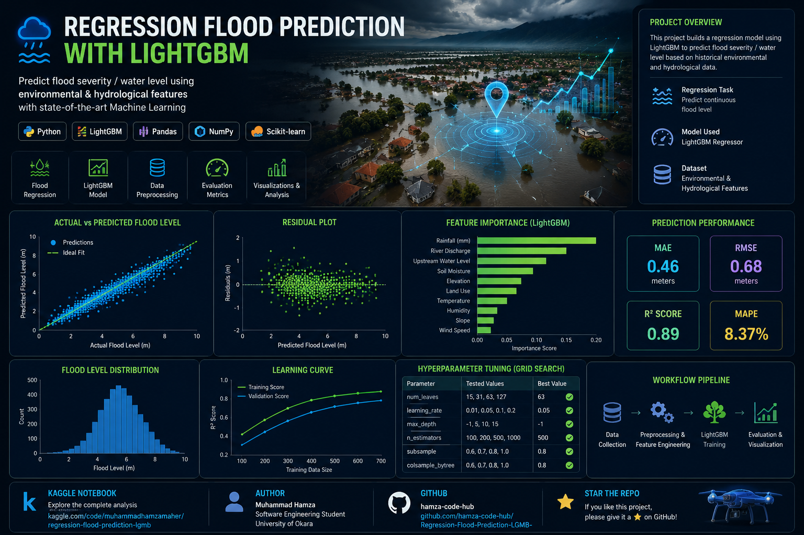
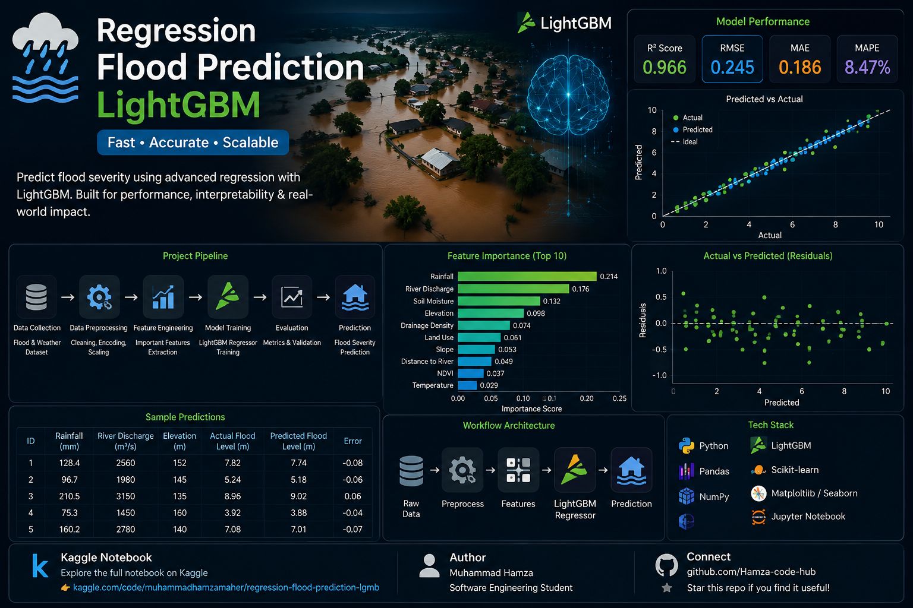
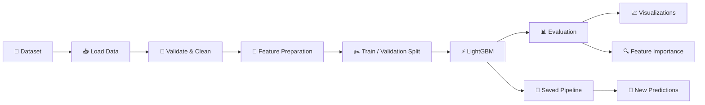

<div align="center">



<br>

# 🌊 Flood Prediction with LightGBM

## Regression, Feature Analysis & Explainable Machine Learning

<p>
An end-to-end <strong>machine learning regression project</strong> for predicting
<strong>flood-related continuous outcomes</strong> from structured environmental data
using <strong>LightGBM</strong>.
</p>

<br>


<br>


<br>


### `LightGBM` • `Regression` • `Flood Prediction` • `Feature Engineering` • `Model Evaluation`

<br>

[](https://www.kaggle.com/code/muhammadhamzamaher/regression-flood-prediction-lgmb)

</div>

---

> [!NOTE]
> The project artwork contains illustrative dashboard values for visual presentation.
> Treat only metrics generated by the repository's evaluation pipeline as actual experimental results.

---

# ✨ Overview

Flood prediction is an important machine-learning problem involving environmental,
geographical, meteorological, and infrastructure-related variables.

This project develops a reproducible regression pipeline using **LightGBM** to learn
relationships between input features and a continuous flood-related target.

The workflow covers the complete machine-learning lifecycle:

```text
Raw Dataset
    │
    ▼
Data Validation
    │
    ▼
Preprocessing
    │
    ▼
Feature Preparation
    │
    ▼
Train / Validation Split
    │
    ▼
LightGBM Regressor
    │
    ▼
Evaluation
    │
    ├── MAE
    ├── RMSE
    ├── R²
    └── MAPE
    │
    ▼
Feature Importance
    │
    ▼
Prediction & Visualization
```

---

# 🎯 Project Objective

The objective is to train a regression model that can estimate a continuous flood target
from structured input data.

For datasets where the target is:

```text
FloodProbability
```

the project predicts the estimated flood probability for each observation.

The implementation is configurable, so another continuous target can also be supplied
through the command line.

---

# 🚀 Key Features

<table>
<tr>
<td width="50%">

### 🌊 Flood Regression

Builds a complete regression workflow for environmental and flood-related structured data.

</td>

<td width="50%">

### ⚡ LightGBM

Uses `LGBMRegressor` for efficient gradient-boosted decision-tree learning.

</td>
</tr>

<tr>
<td>

### 🧹 Automatic Preprocessing

Handles:

- Missing numeric values
- Missing categorical values
- Categorical encoding
- Feature selection
- ID-column exclusion

</td>

<td>

### 📊 Evaluation

Automatically calculates:

- MAE
- RMSE
- R²
- MAPE

and saves machine-readable metrics.

</td>
</tr>

<tr>
<td>

### 🔍 Feature Importance

Extracts and ranks model feature importance to help identify influential predictors.

</td>

<td>

### 📈 Visualization

Automatically generates:

- Actual vs predicted
- Residual plot
- Feature-importance plot
- Target distribution

</td>
</tr>

<tr>
<td>

### 💾 Model Persistence

Stores the complete preprocessing + model pipeline with `joblib`.

</td>

<td>

### 🔮 Reusable Inference

A dedicated prediction script can apply the trained pipeline to unseen CSV files.

</td>
</tr>
</table>

---

# 🖥️ Model & Analysis Overview

<div align="center">



</div>

The project combines preprocessing, gradient boosting, model diagnostics,
feature importance, and reusable inference in one modular workflow.

---

# 🧠 Why LightGBM?

LightGBM is a gradient-boosted decision-tree framework designed for efficient learning
from structured/tabular datasets.

A simplified boosting process is:

```text
Initial Prediction
       │
       ▼
Calculate Error
       │
       ▼
Train Decision Tree
       │
       ▼
Correct Previous Errors
       │
       ▼
Train Next Tree
       │
       ▼
       ...
       │
       ▼
Final Prediction
```

LightGBM is particularly useful for this type of project because it supports:

- Nonlinear relationships
- Complex feature interactions
- Missing-value handling
- Large tabular datasets
- Feature importance
- Efficient training
- Regression objectives

---

# ⚙️ End-to-End Pipeline



---

# 🧹 Preprocessing

The preprocessing pipeline automatically detects numeric and categorical features.

```text
Input Data
   │
   ├── Numeric Features
   │       │
   │       ▼
   │   Median Imputation
   │
   └── Categorical Features
           │
           ▼
     Most-Frequent Imputation
           │
           ▼
       Ordinal Encoding
           │
           ▼
     LightGBM Regressor
```

Because LightGBM is a tree-based method, feature scaling is not required by the
reference implementation.

---

# 📏 Evaluation Metrics

## MAE — Mean Absolute Error

Measures the average absolute difference between predictions and true values.

```text
Lower MAE = Better
```

---

## RMSE — Root Mean Squared Error

Penalizes larger errors more heavily.

```text
Lower RMSE = Better
```

---

## R² — Coefficient of Determination

Measures how much target variance is explained by the model.

```text
R² closer to 1 = Better
```

---

## MAPE — Mean Absolute Percentage Error

Expresses prediction error as a percentage.

The implementation uses a small numerical safeguard for targets close to zero.

---

# 📊 Generated Outputs

After training, the project creates:

```text
outputs/
│
├── metrics.json
├── validation_predictions.csv
├── feature_importance.csv
├── actual_vs_predicted.png
├── residuals.png
├── feature_importance.png
└── target_distribution.png
```

The trained pipeline is stored under:

```text
models/lightgbm_flood_pipeline.joblib
```

---

# 🔍 Feature Importance

Tree-based models can estimate the relative importance of individual predictors.

```text
Input Features
     │
     ▼
LightGBM Trees
     │
     ▼
Importance Scores
     │
     ▼
Ranked Features
```

The repository exports both:

```text
feature_importance.csv
```

and:

```text
feature_importance.png
```

so model behavior can be inspected visually and programmatically.

---

# 📁 Repository Structure

```text
Flood-Prediction-LightGBM/
│
├── .github/
│   └── workflows/
│       └── bootstrap-project.yml
│
├── assets/
│   ├── flood-prediction-lightgbm-hero.png
│   └── flood-prediction-lightgbm-model-overview.png
│
├── data/
│   └── .gitkeep
│
├── models/
│   └── .gitkeep
│
├── notebooks/
│   └── flood_prediction_lightgbm.ipynb
│
├── outputs/
│   └── .gitkeep
│
├── src/
│   ├── __init__.py
│   ├── config.py
│   ├── data.py
│   ├── model.py
│   ├── train.py
│   ├── evaluate.py
│   ├── predict.py
│   ├── visualize.py
│   └── utils.py
│
├── tests/
│   └── test_pipeline.py
│
├── .gitignore
├── pyproject.toml
├── requirements.txt
└── README.md
```

---

# 🛠️ Technology Stack

| Technology | Purpose |
|---|---|
| 🐍 **Python** | Core development |
| ⚡ **LightGBM** | Gradient-boosted regression |
| 🤖 **Scikit-learn** | Pipelines, preprocessing & metrics |
| 🐼 **Pandas** | Tabular data processing |
| 🔢 **NumPy** | Numerical computation |
| 📈 **Matplotlib** | Visualization |
| 💾 **Joblib** | Model serialization |
| 📓 **Jupyter / Kaggle** | Experimentation |

---

# 🚀 Getting Started

## 1. Clone

```bash
git clone https://github.com/Hamza-code-hub/Flood-Prediction-LightGBM.git

cd Flood-Prediction-LightGBM
```

If the repository has not been renamed yet, use its current GitHub URL.

---

## 2. Create a virtual environment

### Windows

```bash
python -m venv .venv
.venv\Scripts\activate
```

### Linux / macOS

```bash
python3 -m venv .venv
source .venv/bin/activate
```

---

## 3. Install dependencies

```bash
pip install -r requirements.txt
```

---

# 📦 Dataset

Place the training CSV inside:

```text
data/train.csv
```

The reference implementation expects the target column:

```text
FloodProbability
```

by default.

If your dataset uses another target:

```bash
python -m src.train \
    --data data/train.csv \
    --target YOUR_TARGET_COLUMN
```

---

# 🏋️ Train

```bash
python -m src.train \
    --data data/train.csv \
    --target FloodProbability
```

Optional example:

```bash
python -m src.train \
    --data data/train.csv \
    --target FloodProbability \
    --test-size 0.20 \
    --estimators 700 \
    --learning-rate 0.05
```

---

# 📊 Evaluate an Existing Pipeline

```bash
python -m src.evaluate \
    --model models/lightgbm_flood_pipeline.joblib \
    --data data/train.csv \
    --target FloodProbability
```

---

# 🔮 Predict New Data

```bash
python -m src.predict \
    --model models/lightgbm_flood_pipeline.joblib \
    --input data/test.csv \
    --output outputs/test_predictions.csv
```

Generated file:

```text
outputs/test_predictions.csv
```

---

# ☁️ Kaggle Notebook

<div align="center">

[](https://www.kaggle.com/code/muhammadhamzamaher/regression-flood-prediction-lgmb)

</div>

The original notebook can also be preserved under:

```text
notebooks/flood_prediction_lightgbm.ipynb
```

---

# 🧪 Reproducibility

The repository separates each stage into reusable modules:

```text
data.py
   │
   ▼
model.py
   │
   ▼
train.py
   │
   ├── evaluate
   ├── visualize
   └── save model
   │
   ▼
predict.py
```

A fixed random seed is used where applicable.

---

# 🗺️ Roadmap

## Machine Learning

- [x] LightGBM regression
- [x] Automated preprocessing
- [x] Validation split
- [x] MAE
- [x] RMSE
- [x] R²
- [x] MAPE
- [x] Feature importance
- [x] Residual analysis
- [x] Reusable prediction pipeline
- [ ] Cross-validation
- [ ] Optuna hyperparameter tuning
- [ ] XGBoost comparison
- [ ] CatBoost comparison
- [ ] Ensemble regression
- [ ] SHAP explanations

## Engineering

- [x] Modular Python structure
- [x] Saved model pipeline
- [x] Tests
- [ ] CI pipeline
- [ ] MLflow tracking
- [ ] REST API
- [ ] Streamlit dashboard
- [ ] Docker
- [ ] Cloud deployment
- [ ] Model monitoring

---

# ⚠️ Disclaimer

> This repository is intended for **research, education, experimentation, and portfolio demonstration**.

Flood-related model predictions should not be treated as an operational emergency warning
system without validated real-world data, calibrated uncertainty estimates, geographic
validation, hydrological expertise, monitoring infrastructure, and appropriate authorities.

---

# 👨‍💻 Author

<div align="center">

### Muhammad Hamza

**AI Developer • Machine Learning • Data Science**

<br>

[](https://github.com/Hamza-code-hub)

[](https://www.kaggle.com/code/muhammadhamzamaher/regression-flood-prediction-lgmb)

</div>

---

<div align="center">

# 🌊 Flood Prediction with LightGBM

## Data → Features → Boosting → Prediction

<br>

**Python × LightGBM × Machine Learning × Environmental Data**

<br>

### 🌧️ Analyze • ⚡ Learn • 📊 Evaluate • 🔮 Predict

<br>

⭐ **If this project helps your learning or research, consider starring the repository.**

</div>
